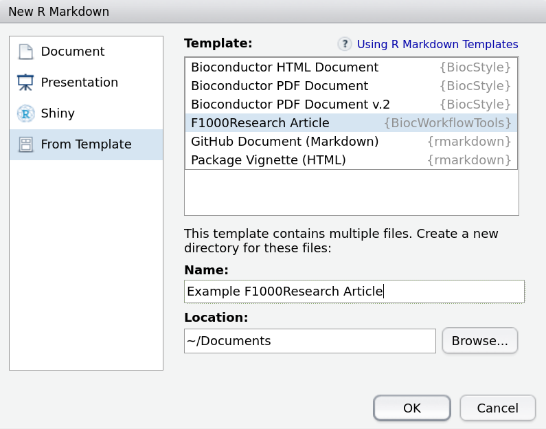

```{r global_options, include=FALSE}
knitr::opts_chunk$set(fig.pos = 'h')
doc_dir <- getwd()
## run all code in a temporary directory
knitr::opts_knit$set(root.dir = tempdir())
```

# Introduction

Bioconductor workflow vignettes are training and good scientific practice resources that demonstrate how one might tackle a particular multi-step bioinformatic analysis, primarily (but not necessarily exclusively) using the software hosted by the Bioconductor project [@huber2015orchestrating].  They expand on the vignettes found in individual software packages by focusing on how multiple tools can be combined to conduct an analysis from beginning to end, rather than highlighting the features of a single resource.  However, they do share many similarities, in particular the desire to write such workflows in a literate programming style, with explanatory text surrounding executable code.  This provides benefit to the reader, who can see each step of a workflow in context, and to the author, who can periodically check that the code is still valid and make changes to reflect either updates to the software they rely on, or improvements in methodology.  These documents are then hosted on the [Bioconductor website](www.bioconductor.org), which provides a centralized location for readers to find the articles and to download the software packages detailed within them.  Workflow authors are encouraged to also submit their work as an article to F1000Research's [Bioconductor Gateway](https://f1000research.com/gateways/bioconductor), which provides the benefits (both to authors and readers) of increased visibility, peer-review and a citable reference.  The intention is that (essentially) identical content will be present in both locations.  

However, the requirements of the two publishing platforms are distinct.  In order to regularly check code functionality and provide a workflow that is straight-forward to download and run by users, Bioconductor needs to be provided with documents written in R Markdown [@rmarkdown2017] or Sweave [@leisch2002sweave], which are compatible with the standard literate programming engines available for R.  On the other hand, F1000Research request submissions in \LaTeX\ or Microsoft Word format, where the code cannot be run directly.  Both parties also apply their own style and branding to the final documents to present a coherent portfolio to end-users.

Given these distinct requirements, it has been somewhat difficult for an author to maintain a single document for submission to both platforms.  This commonly results in prioritization of one over the other, followed by a non-trivial effort to convert to the other.  Alternatively the author faces the challenge of writing two documents at the same time, trying to keep the information content synchronized, whilst dealing with two rather different syntaxes for document layout and formatting.

Here we present a strategy and accompanying tools to help authors develop and maintain a single document that can easily be transformed into the required format for submission to either platform.

# Methods
## Implementation
Given the intention for workflow documents to be full of executable examples that can be regularly checked and updated as necessary, it seems natural to recommend working with one of the literate programming formats available in R, rather than using a static typesetting tool.  As previously mentioned, there are two formats commonly used here: Sweave and R Markdown.  This immediately presents an author with a choice, even before a single word has been written, and there are reasonable arguments for electing to choose either; R Markdown has a simpler syntax and can be easily transformed into HTML for display on a website, while Sweave offers more precise control over document formatting and can readily be converted into a \LaTeX\ format suitable for journal submission.

In order to streamline this, we have chosen to support only R Markdown as an input format, since this can be directly submitted to Bioconductor, with the conversion into the HTML format displayed on the website handled on their side.  This then leaves the challenge of converting R Markdown into a format suitable for journal submission.  To tackle this we have developed **BiocWorkflowTools**, an R package that provides article templates, conversion tools and the ability to upload documents to Overleaf.com (F1000Research's preferred \LaTeX\ submission system).

## Operation
<!--MC: Please include the minimal system requirements to run the package, e.g. the version of R that should be used-->
In order to use **BiocWorkflowTools** the user must have **R** version 3.4.0 or newer installed on their system.  We also recommend working in the RStudio environment, however this is optional and all operations can be carried out at the command line with instructions for both approaches provided below.

### Installation

**BiocWorkflowTools** can be obtained from the Bioconductor package repository by running the following commands in your R session.

```{r packageInstallation, eval = FALSE}
source("http://www.bioconductor.org/biocLite.R")
biocLite("BiocWorkflowTools")
```

<!-- FIXME Can you ask Martin when, instead of this hacky 'source' thingy, people can use `install.packages("BiocInstaller")`, (with that package being on CRAN) ?-->

### Creating a Bioconductor workflow package

Given **BiocWorkflowTools's** raison d'être is to ease the burden of meeting the distinct requirements of two publishing platforms in a hassle-free manner as possible, our recommended strategy assumes that most authors begin a project with the intention of submitting the final outcome to both Bioconductor and F1000Research.  

For the F1000Research the list of material required is straight-forward and familiar: the article itself, a list of references, figures, and supplementary materials. These can then be sent as a collection of files.  When it comes to Bioconductor all the same materials are required; however their computing infrastructure, which enables the regular document checking and easy distribution, also requires that the submission is made in the form of an R package.  There are numerous resources discussing how to create an R package [@wickham2015r] (and we would highly recommend potential authors to read these if they are not familiar with writing packages), but to streamline this process we provide the function `createBiocWorkflow`, which will create the minimum folder structure needed for submission to Bioconductor.  

```{r createBiocWorkflow, message=FALSE}
BiocWorkflowTools::createBiocWorkflow("MyWorkflow",
                                      quiet = TRUE,
                                      open = FALSE)
```

Running the example above will create a workflow package called *MyWorkflow* with the subdirectory *vignettes* containing an article template named *MyWorkflow.Rmd*. It is in this file that one should start developing their workflow document.  In its initial state the template provides an exemplary skeleton of a typical workflow article, along with examples of how to include specific document features such as figures, tables, formulae and code blocks, in much the same way as the more traditional \LaTeX\ and Microsoft Word templates available from F1000Research's website.  The template also includes an example of the required document header, where article metadata such as the title, author names, their affiliations and the abstract are specified.

In the example above, changing the argument `open = TRUE` will open a new RStudio project rooted in the newly created *MyWorkflow* folder.

### Writing only a workflow document

If you do not wish to make a complete package, and instead would simply rather use R Markdown to author an F1000Research article, the recommended platform for most authors is still to work in RStudio.  Rather than creating a new package as before, the user can opt to create a new R Markdown document from the file menu and, assuming the **BiocWorkflowTools** package has been installed, will be presented with the option to use the F1000Research Article template (Figure \@ref(fig:RStudioNew)).

```{r RStudioNew, echo = FALSE, out.width='50%', fig.align='center', fig.cap="Creation of a new article is integrated into RStudio.  The F1000Research template can be accessed via the `New R Markdown' file menu dialog"}

```

This will automatically open a new document based on the F1000Research template described previously.

#### Working outside RStudio

Even if you choose not to work in the RStudio environment, you can still use the included template to create a new file. We recommend using the template as a starting point to facilitate adherence to the required article structure.  The command below will create a folder named *MyArticle* within the current working directory, and this in turn will contain the template **MyArticle.Rmd** which one can edit with the tool of choice.

```{r createDraft}
rmd_file <- rmarkdown::draft("MyArticle.Rmd",
                             template = "f1000_article",
                             package = "BiocWorkflowTools",
                             edit = FALSE)
```


### Conversion to \LaTeX

If you are using RStudio to edit your workflow, the simplest way to create the \LaTeX\ version of your document is to press the 'Knit' button above the document pane in your workspace.  This will process the document and generate both the \LaTeX\ version and a compiled PDF so you can see how the final print version will look.  This process also carries out some necessary housekeeping, such as copying the required F1000Research \LaTeX\ style file and the journal logo into the same location as your document, so you may notice some additional files appearing.

If one prefers to work in an editor other than RStudio, it is still possible to transform the R Markdown file into \LaTeX\ (along with the aforementioned housekeeping) by using the function `render` from the **rmarkdown** package.  This will carry out much the same conversion process as using RStudio, executing the code chunks and producing the expected \LaTeX\ and PDF output files.

<!-- Display the regular call to render but run it quietly -->
```{r render, eval = FALSE}
rmarkdown::render(rmd_file)
```{r renderquiet, include = FALSE}
rmarkdown::render(rmd_file, quiet=TRUE)
```

### Article submission

Ideally submission of a workflow is to both Bioconductor and F1000Research.  Instructions for contributing to Bioconductor are available from https://www.bioconductor.org/developers/how-to/workflows.

Submission of \LaTeX\ articles to F1000Research is currently performed using Overleaf.com, an online collaborative writing and publishing tool.  Complete details are available online, but assuming one has already written an R Markdown workflow and generated a \LaTeX\ source file, they can choose to upload the file directly to Overleaf using their web browser.  

**BiocWorkflowTools** provides the function `uploadToOverleaf` as an alternative option for getting the article into the Overleaf system.  This function takes the document directory and sends this to Overleaf, creating a new project for you automatically.  The function will directly open the new project in a web browser.  

<!-- We don't run this example so it doesn't SPAM Overleaf with lots of new projects -->
```{r uploadToOverleaf, eval=FALSE}
BiocWorkflowTools::uploadToOverleaf("MyArticle")
```

At this point it is important to point out that both the \LaTeX\ and R Markdown versions of the article are present in the Overleaf project, with the first of these being rendered into the document preview one sees on the site.  In the Overleaf environment, only changes to the \LaTeX\ version will be reflected in the preview pane, rather than the R Markdown the author has been working with until now.  Thus it is easy for the two documents to become out of sync if edits are made using the browser interface.  For this reason we recommend only working with Overleaf for the final submission process, and eschewing its document editing features at this point.  Overleaf offers many attractive features such as collaborative editing between authors (particularly those who may not be familiar with the RStudio environment) and live rendering of changes.  However, it should be emphasized again that while it is tempting to want to edit the \LaTeX\ document in the Overleaf environment, this would undermine the motivation behind **BiocWorkflowTools**. Thus, our recommendation is to work exclusively on the R Markdown version of the article (using whichever version control system and collaborative tools the authors prefer) and then use Overleaf purely as a submission portal.

### Article revisions

Assuming the article is provisionally accepted, the journal editors will create a second, private, Overleaf repository for minor copy editing.  Editorial comments and instructions will be included in the R Markdown document, enclosed in comment tags e.g. `<!-- Editorial comment -->`.

At this stage one could edit the R Markdown document in the web browser interface, however there is currently no way to regenerate the \LaTeX\ containing the changes from here.  Instead, to make additional changes after an Overleaf project has been created, we recommend utilizing the fact that all Overleaf projects can be interfaced using `git`.  Instructions for initializing this on your local machine are provided by Overleaf [@overleaf-git]. Since this is a private project the author will need to supply their Overleaf username and password to use git.  If the manuscript is already under git version control, the Overleaf server can be added as an additional remote repository.  Authors can then work on the manuscript offline, and use the regular git commands to keep the local copy in sync, such as `git pull` to get the latest version from Overleaf. Before committing any edits made to the source Rmd file remember to also regenerate the \LaTeX\ output file. Once they are ready to push the changes back to Overleaf, they will instantly appear online.  

```{sh, eval=FALSE}
cd MyArticle
git pull
# make some changes and regenerate the Latex file
git commit -a -m "My edits"
git push
```

Once the authors have addressed the editor's comments resubmission can be performed via Overleaf.

# Summary
**BiocWorkflowTools** provides a straightforward set of helper functions and a document template discoverable in RStudio intended to simplify the process of authoring a source document that can both be run as an executable document, and also submitted to a journal for publication.  We have focused on the collaboration between Bioconductor and F1000Research, and the authoring of R Markdown workflows.  By supporting R Markdown and integrating the document template with RStudio, we hope we have made the path to meeting the requirements of both publication formats simpler for authors.  Currently two distinct documents are still required for submission (R Markdown file, and the \LaTeX\ file derived from this), but the potential exists to move the use of **BiocWorkflowTools** from the author to the journal, thus removing this final hurdle to the ambition of submitting a single source to both locations.  

Although **BiocWorkflowTools** currently only supports the F1000Research article format, support for other scientific journals can be broadened in the future with the addition of more templates to the package, without requiring changes to the underlying workflow.  The authors welcome approaches from publishers that are interested in supporting the submission of R Markdown documents.

To demonstrate and test the tool's utility, this article has been written entirely in R Markdown.

# Software availability
Software available from: http://bioconductor.org/packages/BiocWorkflowTools

Source code available from: https://github.com/grimbough/BiocWorkflowTools

Archived source code as at time of publication: [DOI: 10.5281/zenodo.1208607](https://doi.org/10.5281/zenodo.1208607)

Software license: MIT

# Competing interests
<!--MC: Please complete this section -->
No competing interests were disclosed.

# Grant information
MLS is funded by The German Network for Bioinformatics Infrastructure (de.NBI) Förderkennzeichen Nr. 031A537 A.
AKO is funded by the Federal Ministry of Education and Research (BMBF) grant no. 01EK1502A (BioToP).

# Acknowledgements
The authors would like to thank Michael I. Love for sharing his experience with submitting workflows to both locations and his approaches to document format conversion.  They would also like to thank the F1000Research editorial team for their collaboration in determining how to work with R Markdown as the baseline article format.
<!--MC: Please confirm that Michael is happy to be named in the manuscript-->
<!--MLS: I have checked and he is fine with this-->

# References
